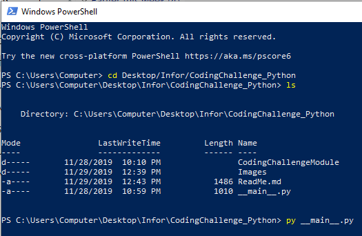
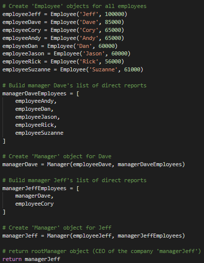
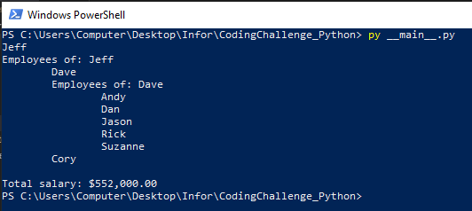
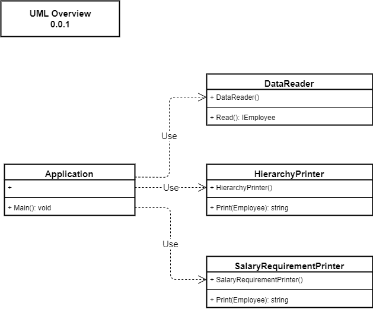

# Coding Challenge Read Me - Python Implementation

## How to Run / Execute

1. On the command line, navigate to the top-level 'CodingChallenge_Python" directory

2. On the command line, type 'py __main__.py'

## Example Program Input and Output

## File Structure

1. CodingChallenge_Python
    * __main.py__
        * The entry point to the console application
        * Composes the functionality from the 'CodingChallengeModule' into an application

    * CodingChallengeModule
        * __init__.py
            * Designates directory as a Python module

        * Classes.py
            * Contains class definitions for 'Employee' and 'Manager' types

        * DataReader.py
            * Class definition for 'DataReader'
            * Provides a 'Read()' method that returns a root 'Manager' object containing the employee hierarchy

        * EmployeeHierarchyPrinter.py
            * Class definition for 'EmployeeHierarchyPrinter'
            * Provides a 'PrintString()' method that formats an employee hierarchy string

        * SalaryRequirementPrinter.py
            * Class definition for 'SalaryRequirementPrinter'
            * Provides a 'PrintString()' method that formats the total salary requirment

## UML Diagram for Idea of How Types are Composed

