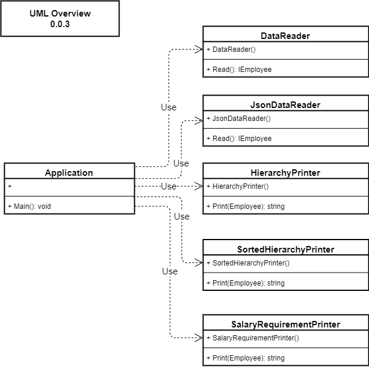

# Coding Challenge Read Me - Python Implementation

## How to Run / Execute

1. On the command line, navigate to the top-level **'CodingChallenge_Python"** directory

2. On the command line, type:
    * **'py __main__.py'**

3. For **UNSORTED** employee hierarchy output:
    * in the **'appsettings.json'** file set **'SortEmployeeHierarchyOutput'** to **'false'**

4. For **SORTED** employee hierarchy output: 
    * in the **'appsettings.json'** file set **'SortEmployeeHierarchyOutput'** to **'true'**

## How to Run Unit Tests

1. On the command line, navigate to the top level **'CodingChallenge_Python'** directory

2. on the command line, type:
    * __'py -m unittest discover -s UnitTests -p '*UnitTests.py' -v'__

## Example Program Input and Output

## File Structure

1. CodingChallenge_Python
    * __main.py__
        * The entry point to the console application
        * Composes the functionality from the 'CodingChallengeModule' into an application

    * CodingChallengeModule
        * __init__.py
            * Designates directory as a Python module

        * Classes.py
            * Contains class definitions for 'Employee' and 'Manager' types

        * DataReader.py
            * Class definition for 'DataReader'
            * Provides a 'Read()' method that returns a root 'Manager' object containing the employee hierarchy

        * JsonDataReader.py
            * Class definition for 'JsonDataReader'
            * Provides a 'Read()' method that reads employee hierarchy data from a JSON file and returns a root 'Manager' object containing the employee hierarchy

        * EmployeeHierarchyPrinter.py
            * Class definition for 'EmployeeHierarchyPrinter'
            * Provides a 'PrintString()' method that formats an employee hierarchy string
            * Employee Hierarchy Data is **UNSORTED**

        * SortedEmployeeHierarchyPrinter.py
            * Class definition for 'SortedEmployeeHierarchyPrinter'
            * Provides a 'PrintString()' method that formats an employee hierarchy string
            * Employee Hierarchy Data is **SORTED**

        * SalaryRequirementPrinter.py
            * Class definition for 'SalaryRequirementPrinter'
            * Provides a 'PrintString()' method that formats the total salary requirment

## UML Diagram for Idea of How Types are Composed

